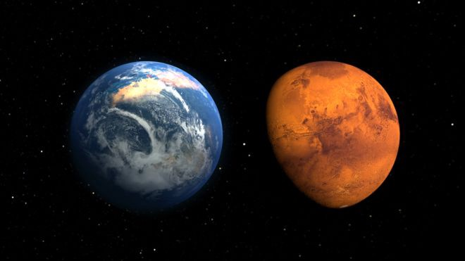

La ficción es tan poderosa que muchas veces se hace realidad.

Aún no comprendo como llegamos a esto. Recuerdo los días anteriores a la pandemia, la cotidianidad transcurría de manera tranquila pero a la vez aburrida. Madrugábamos a trabajar y sufríamos día a día con interminables trancones, en ciudades cada vez menos habitables. Sin embargo, la libertad de la que eramos dueños nos otorgaba cada tanto una descarga de días felices.

De vez en cuando me gusta describir aquellos días a quienes nacieron bajo la presente realidad, para ellos mis historias no son más que ficción, para mí esta realidad es la ficción. Pero bueno, ¿donde iba con mi historia? ah sí la pandemia, esto fue simplemente el inicio de una secuencia de eventos que nos llevaron a este horrible futuro, siéntese y escúcheme.

La tierra empezó a azotarnos cada vez con más desastres naturales. Era como si la naturaleza fuese nuestro ex maligno que regresó a vengarse de nosotros, sin embargo logramos escapar a la extinción, ¿como? gracias a la tecnología por supuesto. Quien imaginaría que esta también nos llevaría a nuestro fin, pero no me adelantaré al relato.

Esta lucha no fue más que un entrenamiento para lo que nos esperaba. Multitud de seres de otros mundos empezaron a visitarnos, algunos de manera pacifica, pero la gran mayoría fueron hostiles, fue así como inicio una espiral de inversión incansable en más armamento.

El constante miedo de ser superados y eliminados o peor aún esclavizados, generó una toma de decisiones progresivamente más autoritarias y excluyentes. Si te lo preguntas, no, aquí no termina mi relato.

Lo peor llego de la mano de una cruenta guerra civil, entre la elite terrícola y el resto de nosotros. Al principio parecía estar balanceado, pero todo termino cuando los autodenominados Homo Deus, alcanzaron capacidades suficientes para empezar a mejorarse a si mismos. Inicialmente fueron simplemente habilidades físicas mejoradas, luego ganaron inmunidad frente a ciertas de nuestras armas, su idioma también cambio, incluso sospechamos que poseen capacidades telepáticas.

Eso fue lo poco que alcanzamos a presenciar, ya que decidimos escapar de la Tierra, ser súbditos del imperio marciano nos resulto una mejor alternativa a serlo de los Homo Deus, después de todo, su lenguaje y costumbres son similares a las nuestras. De humanidad quedo muy poco en la Tierra.

Publicado en https://medium.com/@fabianandrescano/el-d%C3%ADa-que-la-humanidad-abandon%C3%B3-la-tierra-6914623c1fa0