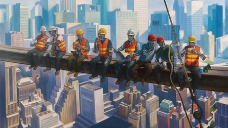

La regla fiscal se relajará, la tasa de interés se reducirá y el endeudamiento estatal aumentará con el fin de enfrentar esta crisis — escucha de manera poco clara Francisco, como si el viejo tv de la sala se lo hubiese susurrado, pero no, el problema no fue de volumen, fue de entendimiento. Que susurro mas inútil — expresa nuestro protagonista dañando la delicada narrativa que intentábamos construir.

Las preocupaciones del narrador y de Francisco distan mucho de ser cercanas. El primero busca promocionarse, usando la realidad social como un elemento literario comercial, el segundo por otra parte convive con ella y este contacto directo cambia su forma de pensar para siempre. La vida es una lucha constante, se repite constantemente Pacho, sin embargo ignora que esas medidas económicas susurradas por el tv, hacen parte de ese estado de bienestar encargado de que la vida no sea esa lucha que el, como muchas otras personas enfrentan día tras día. El problema y tal vez nuestro personaje muera sin descubrirlo e interiorizarlo, es que la debilidad de nuestro estado, es mas una excepción que una regla. ¿Su hambre y la de los suyos es mala suerte? En gran medida, así es.

Pacho opina diferente, no lo expresa directamente, pero es evidente al verlo llorar en soledad, esa culpa parece acompañarlo con la misma pasión que el hambre lo hace. ¿Como podría no ser su culpa el estar desempleado? esta pregunta solo le echa mas leña al debate, ¡ay Pacho! corrientes globalizadoras cegadas por los beneficios innatos del comercio internacional, han generado una competencia tan fuerte entre países, que procesos de producción humana han pasado a requerir eficiencia inhumana con el fin de competir. Así fue como la automatización pasó a ser el MVP(Most Valuable Player) en este juego de la vida.

Hace mucho me contaron una historia. Un brillante ingeniero trabajaba hace ya muchos años en la automatización de procesos para empresas, era tal su pasión que ningún reto lo vencía, pero su mundo se vino abajo con un descubrimiento, una de las personas a quien su trabajo había dejado desempleado no aguantó la presión y desde el ultimo piso de la empresa para la que trabajaba se lanzó al vacío, en un ultimo intento de ser importante, de no ser algo simplemente reemplazable. Una de los cerca de 5000 personas(mal calculadas) que su ejercicio profesional había dejado sin esa sensación de importancia. En un ejercicio casi poético, el ingeniero tomó la decisión de el también lanzarse al vacío, tal vez llamado por el vértigo, buscando purgar una culpa que no debía ser purgada.

Esta no es una invitación hacia el vacío Pacho, pero es evidente que cada vez eres menos importante para el sistema, a menos que te especialices, por supuesto. ¿Como, cuando y donde? pregunta animado. Lamento decírtelo pero todo se reduce a “cuanto y cuando”, y supongo inequívocamente que el dinero y el tiempo no son cosas que te sobran. Son pocas las esperanzas mi amigo, por fortuna tú eres un personaje ficticio, pero muchos Pachos allá afuera no lo son.

PD: En latinoamerica, solo el 14% de las personas en edad y condiciones de ir a la universidad lo hacen, ¿Es todo un privilegio no?

Publicado en https://medium.com/@fabianandrescano/entender-y-vivir-669ac213aea2